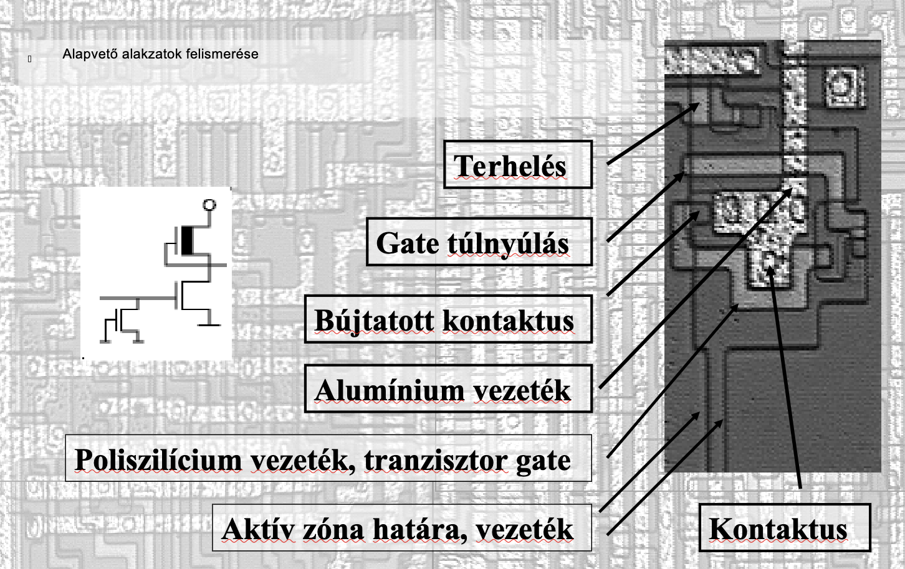

# 6502-reverse-engineering

Restoring the full transistor-level schematic of the famous 6502 retro CPU was my pet project at university back in 2001.
After three months of working with microscope photos of the silicon layout, I had identified all 4,200 transistors.
I also figured out why it had so many undocumented opcodes, which had been a big mystery in the Commodore 64 era.

I received a special award at a scientific student association conference, and a few years later I gave a talk at the Hacktivity conference.
Since the full schematic is available on the internet, I still get questions about it, mostly from retro computing communities.

Unfortunately, my old PHP-based website no longer works. Because this content may still be interesting to the public—especially the retro computing community—this Git repository will serve as the new temporary storage until I come up with a better solution.

